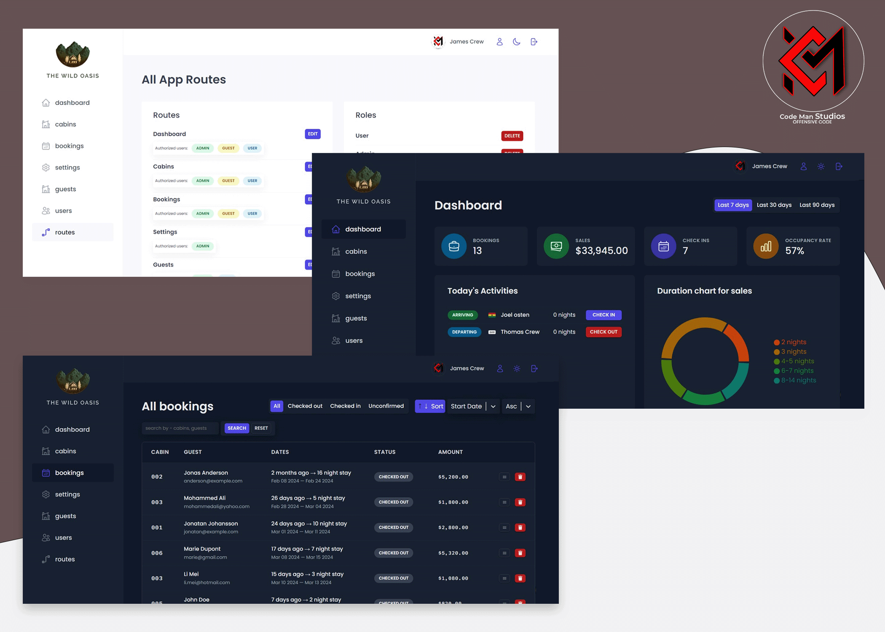

# The wild oasis
Simple Hotel booking management application with role based authentication and route authorization. The administrator has exclusive access privileges while general users have limited access. The admin can authorize and remove users from the system.

visit [here](https://the-wild-oasis-sigma-gilt.vercel.app)
use logoso2345@nimadir.com
and 12345678 as password to login

## Technologies Used
- JavaScript
- Supabase
- React
- React-router
- React-query
- React-Hook-Forms
- React-Select
- Date-fontSize
- React-Hot-Toast
- Styled-Components

## Installation
1. Clone the repository: [GitHub Repo URL](https://github.com/Aboagye-Dacosta/the-wild-oasis)
2. Install dependencies.
3. Change the supabase client and set up the following tables `bookings` `guests` `roles` `routes` `cabins`

## Author

 Dacosta Aboagye Solomon

 

  
  
  

